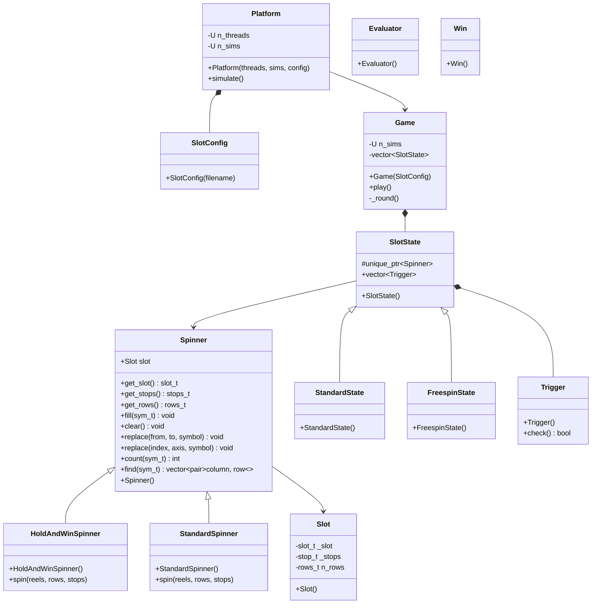

## Slot
- Only contains the DS.

## Spinner
- Manipulator class of Slot, offers manipulation APIs to spin "recepies".
- `spin(spin_func)` method executes the spinning recepie `spin_func`.

## Platform
- Manages multithreding
- Manages Data aggregation
- Multithreads on `Game`

## Game
- Manages the Slot state machine depending on which trigger was activated
- Returns data to the `Platform`
- `_round()` starts at state 0, travels the state machine until it gets back to 0. Analogously populates the stack until it's empty.
- `play()` calls `_round()` `sim` times.

## Definitions
- `Slot`: a DS containig symbols with utils to generate a new slot, and manipulation
- `Platform`: Manages the concurrency
- `Game`: Necessary middleware to handle the `Slot`'s state. Applies `Triggers` and evaluates `Slot` using `Evaluators`
- `Triggers`
- `Evaluators`


## SlotConfig
The `.json` specifies the states of the machine. The triggers are coded.
```json
{
    "states": [
        0,
        1
    ],
    "slots": {
        "0": {
            "reels": 5,
            "rows": 3,
            "symbols": [1,2,3,4,5,6,7,8,9],
            "paylines": {
                "0": [2,2,2,2,2],
                "1": [0,0,0,0,0],
                "2": [1,1,1,1,1]
            },
            "paytable": {
                "1": [7.50,2.5,1,5],
                "2": [3.75,2,1]
            }
        },
        "1":{
           "Other state":1
        }
    }
}
```


## Decisions
- Keep stuff private and add fuctionality that can be tested.
- Configuration starts by numbering the slots and their interaction


## TODO
- Cascade Feature


