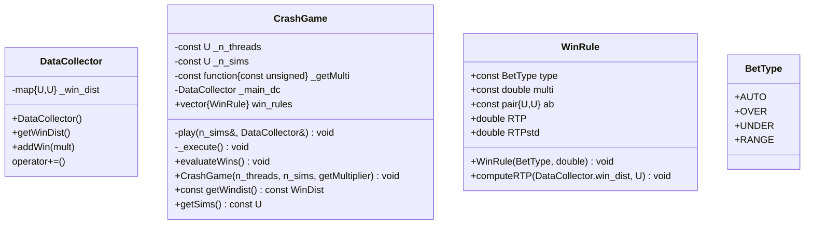

## CrashGame
- `GetMultiplier`:  inversly samples the CDF. Returns the multiplier.
- `BinarySearch`: Utils function if we need to sample a non-conditional CDF.
- `Play`: Plays the game for `n_sims` times while updating the `DataCollector`

## DataCollector
- `getWinDist`: Getter for the winning distribution
- `addWin`: Adds the win to `win_dist`

## WinRule
- `WinRule`: takes `BetType` type & `double` multiplier to compute the bet's RTP

### CalculateRTP

$$\mathrm{RTP} =\langle m \rangle =m \cdot \mathbb{P}[win]\approx \frac{m\cdot n}{N}$$
$$\sigma_{\mathrm{RTP}}^2 = \langle m^2 \rangle - \langle m \rangle^2= m^2\cdot \mathbb{P}[win]\left(1-\mathbb{P}[win]\right)\approx \frac{m^2\cdot n \cdot (N-n)}{N^2}$$

## Game
- `Execute`: Spawns threads and plays
- `Merge`: Merges data from DataCollectors into `main_dc`
- `ApplyRules`: Computes RTP of every rule given at init using `main_dc` & `WinRule.ComputeRTP()`


# CMake structure
```
Project
├── include/  
|   ├── crashgame/  
|   |   ├── include/
|   |   |   ├── crash_game.h
│   |   │   └── data.h
│   |   ├── src/
│   |   |   ├── crash_game.cpp
│   |   |   └── data.cpp
|   |   └── header.h
|   └── crashgameutils/ 
|       ├── include/
│       │   └── utils.h
│       ├── src/
│       |   └── utils.cpp 
|       └── header.h
└── src/  
    └── main.cpp  
```


## Test Game
Max multiplier: $M$.  
Precision of two decimal places.  
From uniform random number:  
$$u \sim \mathrm{Unif}(0,1) \Rightarrow m=
\left\{\begin{matrix}
0 & Mu < 1\\
\lceil 100Mu\rceil/100 & Mu\geq 1
\end{matrix}\right.
$$
The RTP is $$\mathrm{RTP}=1-M^{-1}$$
Top multiplier is obtained when:  
$$M-M^{-1}\leq u\leq 1$$
Normally a multiplier of $1$ is not allowed.


## CDF formulation
The `CDF` is stored as iterable.  
The first element is always $0$, which is not specified. The last element is always $1$, which needs to be specified.  
If the `CDF` is sampled in $N$ points in, then inside the iterable there are `N+1`, since we need to include 1.  
Thus the N points are all $\in (0,1)$, the first defines the RTP, the last gives the probability of hitting the max multilpier.  
Mapped to the $N$ points in the `CDF` there are $N$ multipliers. Starting from $1.01$ up to the max.  
The first multiplier inside the data structure that contains them is $0$.  
Thus there are both $N+1$ points inside `CDF` and the multipliers.
The multiplier is obtained by inverse sampling the `CDF`. Using $$u\sim \mathrm{Unif}(0,1)$$ 
we get:  
$$m = \mathrm{CDF}^{-1}(u)$$
`binarySearch` finds the least upper bound to $u$.  
If $u$ is less than the first element inside `CDF`, the retured index is $0$ which correspond to the zero multiplier, and so on. At the end, if $u$ is greater than the last $N$ point, but clearly still $<1$, then the index is `arr.size() - 1` which correspond with the max multiplier.

## TODO
- Add perfect forwarding to `CrashGame` constructor

